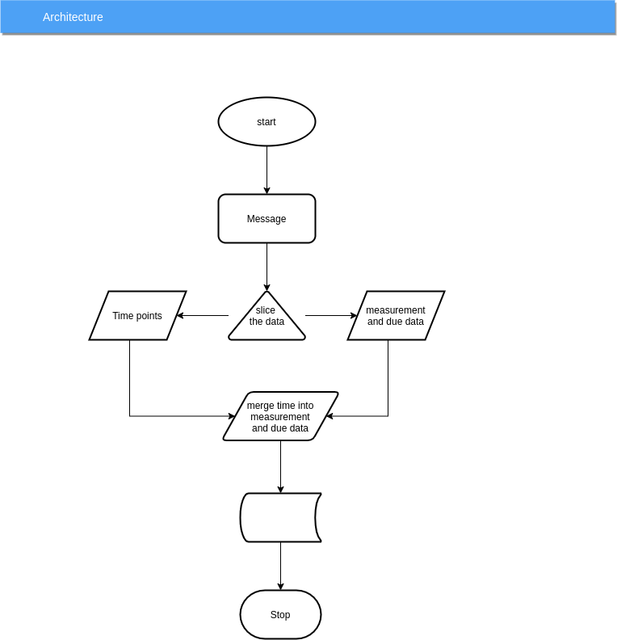
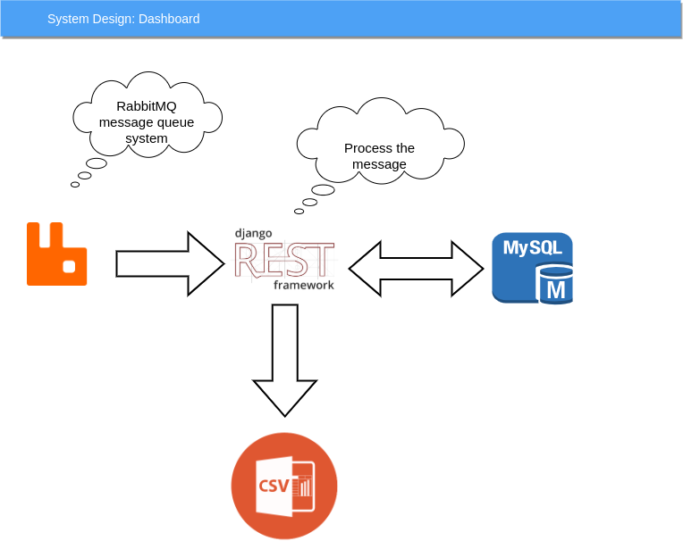
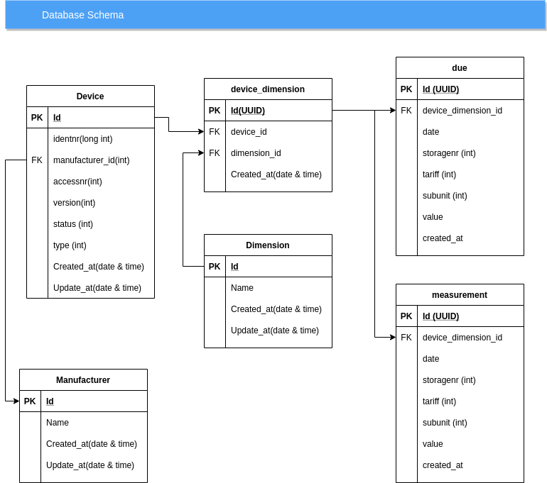

# Metr data transfer
Django rest framework

### Requirement:
* Python
* Django Rest framework
* RabbitMQ
* MySQL
* docker

### Architecture:
#### Architecture 

#### Structure

#### Schema


#### Step-1
1. Install Docker 
2. git clone https://github.com/sbsanjaybharti/metr_data_transfer.git
3. Oper the terminal in the folder and run two commands<br/>
```
   >>> docker-compose build
   >>> docker-compose up
```

#### Step-2
1. open the link http://localhost:8080/ here you will get the link url like app, database, queue.
2. You can use the url provided or IP link in right, 
3. RabbitMQ: http://rabbit.docker.localhost
4. MYSQL: http://phpmyadmin.docker.localhost use IP if its not working
  username: root
  password: example
  database metr
5. Application: http://development.docker.localhost  
   
 #### Step-3 Database setup
1. Open the link http://phpmyadmin.docker.localhost
2. Username: root, password: root
3. create database metr
4. on the terminal follow the command
5. docker-compose exec development /bin/bash
6. python manage.py makemigration
7. python manage.py migrate
8. python manage.py rmq start( to start the rabbitMQ worker to consume the message)

#### Step-4 Check RabbitMQ
1. Open the url http://rabbit.docker.localhost/
2. Create Exchange" csv-exchange, Routing key: csv-routing-key, Queue; csv-queue
3. Now if you add message to queue the data will transfer to MySQL


